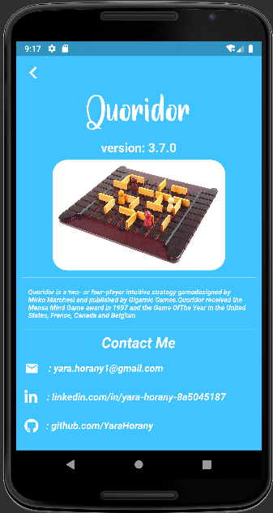

# Quoridor

## :pencil: General info

[Quoridor](https://en.wikipedia.org/wiki/Quoridor) is a two- or four-player intuitive strategy game designed by Mirko Marchesi and published by Gigamic Games. 
Quoridor received the Mensa Mind Game award in 1997 and the Game Of The Year in the United States, 
France, Canada and Belgium.

## :book: Rules

Quoridor is played on a game board of 81 square spaces (9×9). 
Each player is represented by a pawn which begins at the center space of one edge of the board (in a two-player game, the pawns begin opposite each other). 
The objective is to be the first player to move their pawn to any space 
on the opposite side of the game board from which it begins.

## :gear: Technologies

Project is created with:

- [Flutter](https://flutter.dev/) version: 3.7.0
- [Dart](https://dart.dev/) version: 2.19.0
- [Get](https://pub.dev/packages/get) version: 4.6.5
- [Flutter_staggered_grid_view](https://pub.dev/packages/flutter_staggered_grid_view) version: 0.6.2
- [Share_plus](https://pub.dev/packages/share_plus) version: 7.0.2
- [Flutter_spinkit](https://pub.dev/packages/flutter_spinkit) version: 5.2.0
- [Font_awesome_flutter](https://pub.dev/packages/font_awesome_flutter) version: 10.3.0
- [Url_launcher](https://pub.dev/packages/url_launcher) version: 6.0.3

## :camera_flash: Screenshots

| Intro screen                                                              | Choose AI level window                                                       | Game rules screen                                                       | About Me screen                                                              |
|---------------------------------------------------------------------------|------------------------------------------------------------------------------|-------------------------------------------------------------------------|------------------------------------------------------------------------------|
|  |  |  |  |

| Playing mode                                                              | New game window                                                              | Winning window                                                              | Losing window                                                              |
|---------------------------------------------------------------------------|------------------------------------------------------------------------------|-----------------------------------------------------------------------------|----------------------------------------------------------------------------|
|  |  |  |  |

## :computer: Setup