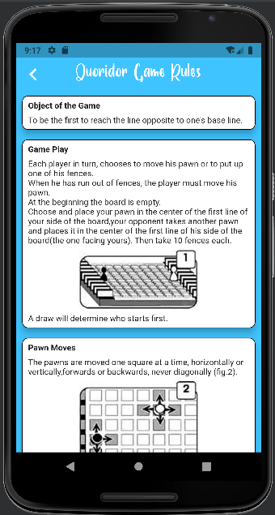

# Quoridor

## :old_key: About

The Application is built with Flutter and GetX State, Route & Dependency Managements.

## :pencil: General info

[Quoridor](https://en.wikipedia.org/wiki/Quoridor) is a two- or four-player intuitive strategy game 
designed by Mirko Marchesi and published by Gigamic Games. 
Quoridor received the Mensa Mind Game award in 1997 and the Game Of The Year in the United States, 
France, Canada and Belgium.

## :clipboard: Rules

- **Board:** Quoridor is played in a nine by nine board (81 square cells). 
We focus only on the two-player version, and each player starts with 10 fences.

- **Game setup:** Each player is represented by a pawn (Green or Orange) 
which begins at the center space of the baseline.

- **Gameplay:** The green player starts first, then players alternate turns. 
Each player at his turn can choose to move his pawn or to place one of his fences. 
Once the player runs out of fences, its pawn must be moved.

- **Pawn moves:** Pawns are moved one square at a time, horizontally or vertically, 
forwards or backwards.  
When two pawns face each other on neighboring squares which are 
not separated by a fence, the player whose turn is it can jump over the opponent’s
pawn and place himself behind the opponent’s pawn, thus advancing an extra square.  
If there is a fence behind the pawn, the player can place his pawn to the left
or the right of the opponent’s pawn. Fences may not be jumped, 
including when moving laterally due to a fence being behind a jumped pawn.

- **Positioning of the fences:** Fences can be placed directly between two spaces, in
any groove not already occupied by a fence. 
However, a fence may not be placed which cuts off the only remaining path of any pawn to the goal.

- **End of the game:** The first player who reaches one of the 9 squares of his 
opponent’s base line is the winner.

## :cloud: Overview

In this project you can choose to play a Multi player game OR 
a Single player game (AI will play against the user).  
The AI agent playing Quoridor is based on [Monte Carlo tree search (MCTS)](https://en.wikipedia.org/wiki/Monte_Carlo_tree_search),
as it appears to be an efficient algorithm for this type of board game and
game tree size. 
Monte Carlo tree search is a heuristic search algorithm that relies on intelligent tree search to make decisions. 
It’s most often used to perform game simulations. 
I have built a game tree with a root node, then it is expanded with random simulations. 
In the process, we maintain the number of times we have visited a specific
node and a win score, used to evaluate the state of the board. 
In the end, we select the node with best results and higher win scores. 
This algorithm consists of four phases: Selection, Expansion, Simulation and Backpropagation. 
I improved The system by adding a heuristic. The heuristic helps
us to balance the placement of fences and the moves of the pawn.

## :gear: Technologies

Project is created with:

- [Flutter](https://flutter.dev/) version: 3.7.0
- [Dart](https://dart.dev/) version: 2.19.0
- [Get](https://pub.dev/packages/get) version: 4.6.5
- [Flutter_staggered_grid_view](https://pub.dev/packages/flutter_staggered_grid_view) version: 0.6.2
- [Share_plus](https://pub.dev/packages/share_plus) version: 7.0.2
- [Flutter_spinkit](https://pub.dev/packages/flutter_spinkit) version: 5.2.0
- [Font_awesome_flutter](https://pub.dev/packages/font_awesome_flutter) version: 10.3.0
- [Url_launcher](https://pub.dev/packages/url_launcher) version: 6.0.3

## :camera_flash: Screenshots

| Intro screen                                                              | Choose AI level window                                                       | Game rules screen                                                       | About screen                                                                 |
|---------------------------------------------------------------------------|------------------------------------------------------------------------------|-------------------------------------------------------------------------|------------------------------------------------------------------------------|
|  |  |  |  |

| Playing mode                                                              | New game window                                                              | Winning window                                                              | Losing window                                                              |
|---------------------------------------------------------------------------|------------------------------------------------------------------------------|-----------------------------------------------------------------------------|----------------------------------------------------------------------------|
|  |  |  |  |

## :arrow_forward: Future work

Implementing Dynamic Simulation Monte Carlo Tree Search: Speed up the inference time 
by Stopping the searching of MCTS earlier when we are confident with the 
current searching result.

## :open_book: References

- Victor Massagué Respall, Joseph Alexander Brown and Hamma Aslam. 
[Monte Carlo Tree Search for Quoridor](https://www.researchgate.net/publication/327679826_Monte_Carlo_Tree_Search_for_Quoridor). 2018.