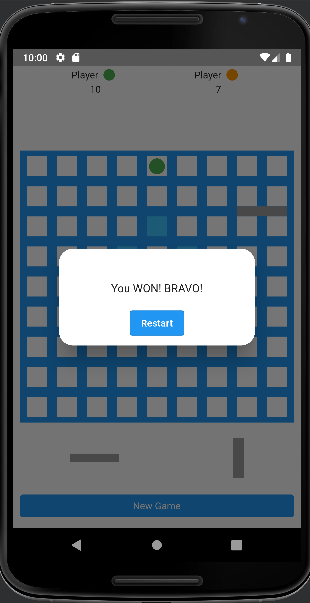

# Quoridor

## :old_key: About

The Application is built with Flutter and GetX State, Route & Dependency Managements.

## :pencil: General info

[Quoridor](https://en.wikipedia.org/wiki/Quoridor) is a two- or four-player intuitive strategy game 
designed by Mirko Marchesi and published by Gigamic Games. 
Quoridor received the Mensa Mind Game award in 1997 and the Game Of The Year in the United States, 
France, Canada and Belgium.

## :clipboard: Rules

- **Board:** Quoridor is played on a game board of 81 square cells (9×9) 
and each player starts with 10 fences.

- **Game setup:** Each player is represented by a pawn (Green or Orange) 
which begins at the center space of the baseline.

- **Gameplay:** The green player starts first, then players alternate turns.
Each player in turn, chooses to move his pawn or to put up one of his fences.
if he runs out of fences, then he can only move his pawn.

- **Pawn moves:** The pawns are moved one square at a time,
horizontally or vertically, forwards or backwards.

- **Positioning of the fences:** Fences can be placed between 2 sets of 2 squares.
The fences can be used to block their opponent from moving their own pawns across the board.
The only real rule about fence placement is that you must always
leave a path for your opponent to be able to reach his goal.

- **End of the game:** The first player to move their pawn to any
of the squares opposite of his baseline is the winner.

## :cloud: Overview

In this project you can choose to play a multi player game OR 
a single player game (AI will play against the user).
The AI agent playing Quoridor is based on [Monte Carlo tree search (MCTS)](https://en.wikipedia.org/wiki/Monte_Carlo_tree_search).
Monte Carlo tree search is a heuristic search algorithm that relies on intelligent tree search to make decisions. 
It’s most often used to perform game simulations.
The algorithm has four phases: Selection, Expansion, Simulation and Backpropagation.
I added some heuristics to the algorithm to improve the performance of MCTS.

## :gear: Technologies

Project is created with:

- [Flutter](https://flutter.dev/) version: 3.7.0
- [Dart](https://dart.dev/) version: 2.19.0
- [Get](https://pub.dev/packages/get) version: 4.6.5
- [Flutter_staggered_grid_view](https://pub.dev/packages/flutter_staggered_grid_view) version: 0.6.2
- [Share_plus](https://pub.dev/packages/share_plus) version: 7.0.2
- [Flutter_spinkit](https://pub.dev/packages/flutter_spinkit) version: 5.2.0
- [Font_awesome_flutter](https://pub.dev/packages/font_awesome_flutter) version: 10.3.0
- [Url_launcher](https://pub.dev/packages/url_launcher) version: 6.0.3

## :camera_flash: Screenshots

| Intro screen                                                              | Choose AI level window                                                       | Game rules screen                                                       | About Me screen                                                              |
|---------------------------------------------------------------------------|------------------------------------------------------------------------------|-------------------------------------------------------------------------|------------------------------------------------------------------------------|
|  |  |  |  |

| Playing mode                                                              | New game window                                                              | Winning window                                                              | Losing window                                                              |
|---------------------------------------------------------------------------|------------------------------------------------------------------------------|-----------------------------------------------------------------------------|----------------------------------------------------------------------------|
|  |  |  |  |

## :open_book: References

- Victor Massagué Respall, Joseph Alexander Brown and Hamma Aslam. 
[Monte Carlo Tree Search for Quoridor](https://www.researchgate.net/publication/327679826_Monte_Carlo_Tree_Search_for_Quoridor). 2018.